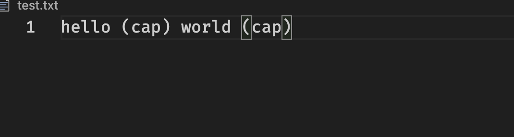
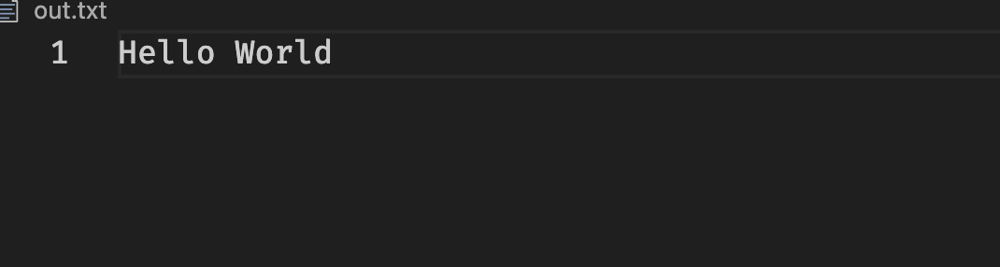
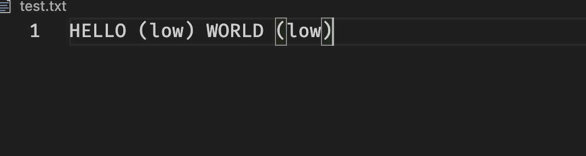
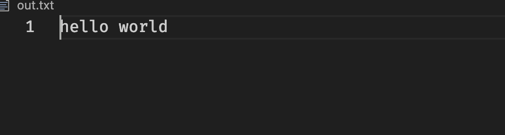
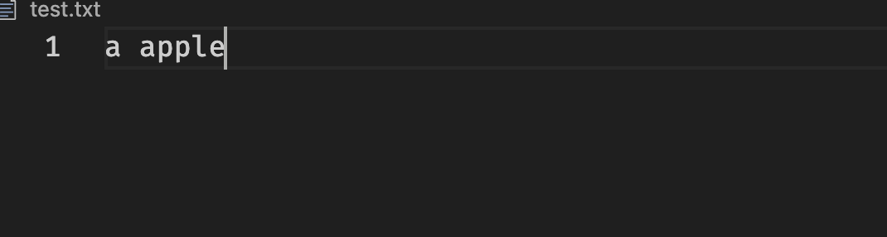
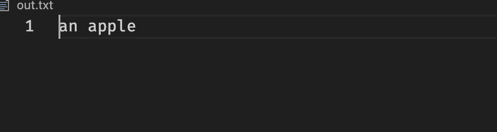
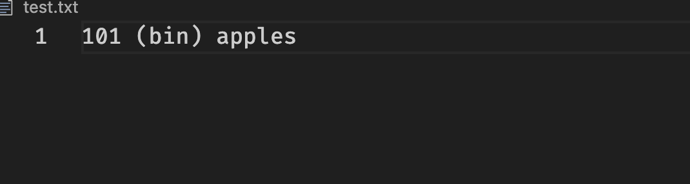
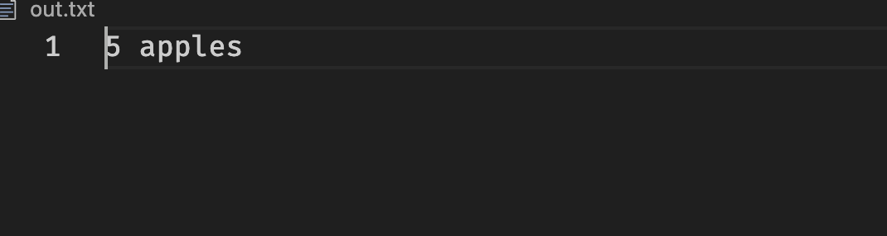

# go text formatter

a special text formatter written in go that has the following capabilities
- Capitalize
- uppercase
- lowercase
- fix a, an based on the previous word
- fix incorrect spacing around punctuation

also it can do number operations
- convert hex to decimal
- binary to decimal

example of capitalization (notice how the first letter of each word is now uppercase)

example of lower case

example of an or a confusion fix

example of numbering system converter

